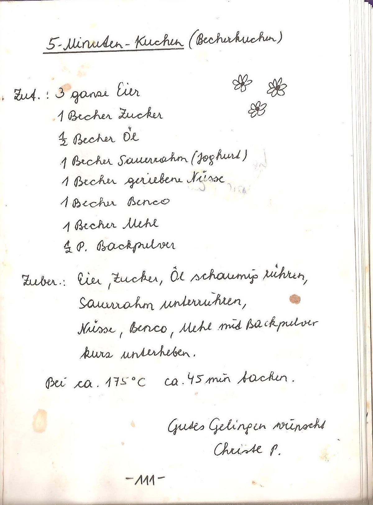

# A Taste Of Austria

Everything which makes Austria so special in lovely Nuremberg and beyond :)

Follow me on [Twitter](https://twitter.com/dnsmichi) and [Instagram](https://www.instagram.com/netmichi/).

1. [Cookies](#cookies)
2. [Cakes](#cakes)
3. [Coffee](#coffee)
4. [Gin](#gin)
5. [Beer](#beer)
6. [Sweets](#sweets)
7. [Healthy](#healthy)

## Cookies 

### Dragee Keksi

If I just can stop ... "Wenn ich nur aufhörn könnt - WINAK". Taste them, you cannot stop.

You can get them from the [official Manner store](https://www.austriansupermarket.com/catalogsearch/result/?q=dragee+keksi).

### Manner Wafers

Classic or in variations, it tastes so good. [Manner Store](https://www.manner.com/en/products/wafers/original-neapolitan-wafers).

When you are in Austria, look for the [Manner Shops](https://josef.manner.com/de/shops). They have not so good manufactured quality for lower prices.

## Cakes 

### Linzer Torte

The one and only from my hometown, [Jindrak](https://www.jindrak.at/original-linzer-torte/) owns the original recipe.

### Grammastettner Krapferl

Lightweight coffee cookies with a sweet taste, get them in Linz (Spar): https://www.hummels-krapferl.at/

### Becherkuchen

The one and only chocolate cake with either nuts or poppyseed. Easy to bake, much to impress.

Original recipe from Mühlviertel, Upper Austria:

### Sacher Torte

The one and only, with whipped cream. Can be ordered [here](https://www.sacher.com/en/original-sacher-torte/).

## Coffee 

### Julius Meinl

The "President" flavor with soft ([blue](https://shop.meinl.com/euro_de/coffee/president-mild-gemahlen-500g.html))
and stronger ([red](https://shop.meinl.com/euro_de/president-gemahlen-500g.html)) is my all time favorite.

Best is to buy them directly in Austria, exports cost quite a bit more.

## Gin 

### UUAHOUUA

Produced by [Wieser Wachau](https://www.wieserwachau.com/produkt/classic-gin-070l/).

### Slowberry Blue Gin

A fresh taste, more details [here](https://www.fuxbau-gin.at/).

### Fuxbau

My newest love. More details [here](https://www.fuxbau-gin.at/).

### Gin Alpin

A fresh and fruity taste. Made by a small distillery in Hallein/Salzburg.
Have a look [here](https://www.guglhof.at/2014/das-sortiment/gin-alpin)

### Walser Brennkammer Gin

My (@rockaut) absolute favourite! A fresh and fruity taste but it doesn't miss a punch. Made by a micro-destillery in Salzburg Wals.
Have a look [here](http://www.walserbrennkammer.at)

## Beer 

### Wieselburger

Tastes good and originally is known for the "blopp" on open. A friend of mine brought me into the normal bottles, back in Vienna. Originally from Lower Austria.

- [wieselburger.at](https://www.wieselburger.at/)

### Murauer

We've been there for summer holidays, and also have visited the brewery. The beer is really tasty and best to be enjoyed with a view on the alps.

- [murauerbier.at](https://www.murauerbier.at/)

### Stiegl: Paracelsus Zwickl

Not a blonde, but naturally cloudy. Light and sweet with its taste, and it feels like home.

- [stiegl.at](https://www.stiegl.at/en/beers/classic-beers/stiegl-paracelsus-zwickl)

### Stiegl Radler: Grapefruit

The taste of grapefruit combined with a fresh beer. Summer is coming!

- [stiegl-shop.at](https://www.stiegl-shop.at/braushop/at/shop/5000/700000/Stiegl-Radler-Grapefruit/?card=4122)

### Gösser Lemon Radler

It is 60% lemon and 40% beer which makes this the perfect fit for a hot summer. Get a tray of 24 cans and sit somewhere near the (Danube, Pegnitz) river and enjoy life.

- [REWE Online](https://shop.rewe.de/PD2828882)

## Sweets 

### Mozartkugeln ( Mozart ball(s) ;-) )

While there is a discussion about the "original" ones (https://en.wikipedia.org/wiki/Mozartkugel) - basically they are both good and made of pistachio marzipan and nougat that is covered with dark chocolate ... and both are fantastic.

- Original Salzburger Mozartkugel by Fürst (http://www.original-mozartkugel.com)
- Echte Salzburger Mozartkugel by Mirabell (https://www.mozartkugel.at)

## Healthy 

### Kürbiskern Öl (Pumpkin Seed Oil)

Only the one from Styria: https://www.steirische-spezialitaeten.at/kulinarik/steirisches-kuerbiskernoel-gga.html

